<div align="center">

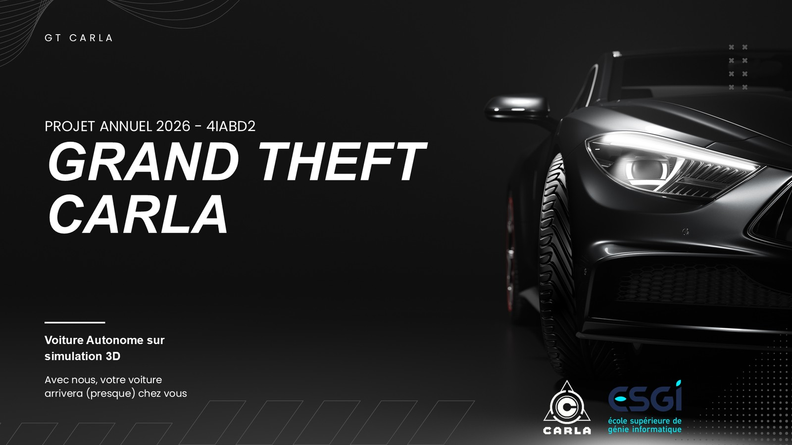

# GT CARLA

### Grand Theft Carla: autonomous driving from a single camera

A car drives itself through the **CARLA** simulator using only a front RGB camera. Perception models turn each frame into 14 numbers, and a small PPO policy turns those numbers into steering and acceleration.

[](https://www.python.org)
[](https://carla.org)
[](https://pytorch.org)
[](https://stable-baselines3.readthedocs.io)
[](https://docs.ultralytics.com)
[](https://onnxruntime.ai)
[](https://docs.astral.sh/uv/)
[](#-the-scoreboard)

[The idea](#-one-camera-no-cheating) · [Demo](#-see-it-in-action) · [Seeing](#-seeing-the-road) · [Navigating](#-knowing-where-to-go) · [Deciding](#-deciding-what-to-do) · [v1 → v23](#-from-v1-to-v23) · [The breakthrough](#-the-938--problem) · [The scoreboard](#-the-scoreboard) · [The data](#-a-dataset-that-labels-itself) · [Serving](#-serving-the-policy) · [Quick start](#-try-it-yourself) · [Team](#-team)

</div>

---

## 🚗 One camera, no cheating

CARLA can tell an agent everything: where the lane is, how far the next car is, whether the light is red. We didn't let the policy use any of that. It sees **one front RGB camera**, and everything it knows about the road comes from **perception models**.

**GT CARLA**, short for *Grand Theft Carla*, is our 4th-year annual project at ESGI, in the AI & Big Data track (class 4IABD2). Four students built it over five months (February to July 2026), with four modules owned by four people (perception, lane detection, navigation, decision AI) connected through typed contracts.

The final model, **v23**, won **7 of the 8 graded scenarios** of our benchmark with **zero collisions across all 13 scenarios**, using real perception for lanes and objects. Its best demo drives **156 m along a GPS route without a single collision**.

---

## 🎬 See it in action

<p align="center">
  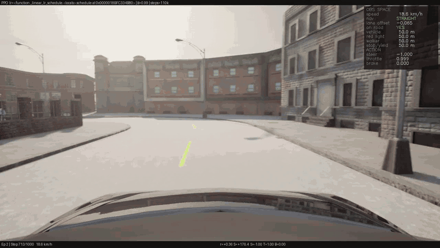
  <br /><sub><em>The final model driving through Town02. It spots a van 15 m ahead and keeps its lane. The HUD (top right) shows what the policy sees and what it decides, live.</em></sub>
</p>

---

## 🧩 The setup

- **Simulator:** CARLA 0.9.16 (Unreal Engine), with intersections, traffic lights, signs, pedestrians and traffic.
- **One map, one weather** for the decision AI: Town02, clear sky.
- **Synchronous mode at 20 FPS**, so every run can be reproduced exactly.
- **A single camera** behind the rear-view mirror.
- **Traffic:** 18 autopilot vehicles (CARLA Traffic Manager) and 6 AI pedestrians.

<table width="100%">
  <tr>
    <td width="50%">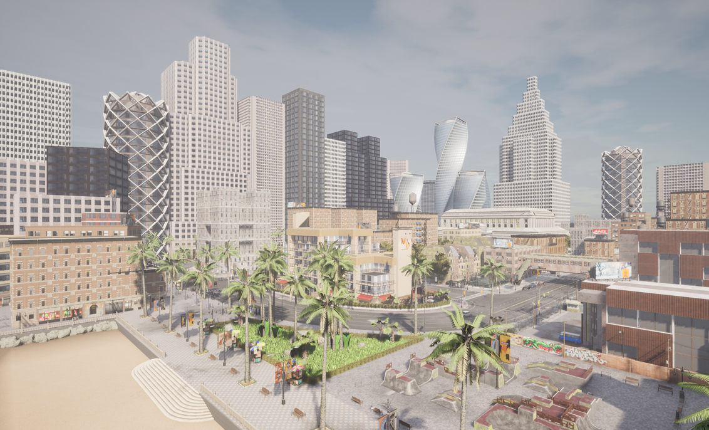</td>
    <td width="50%">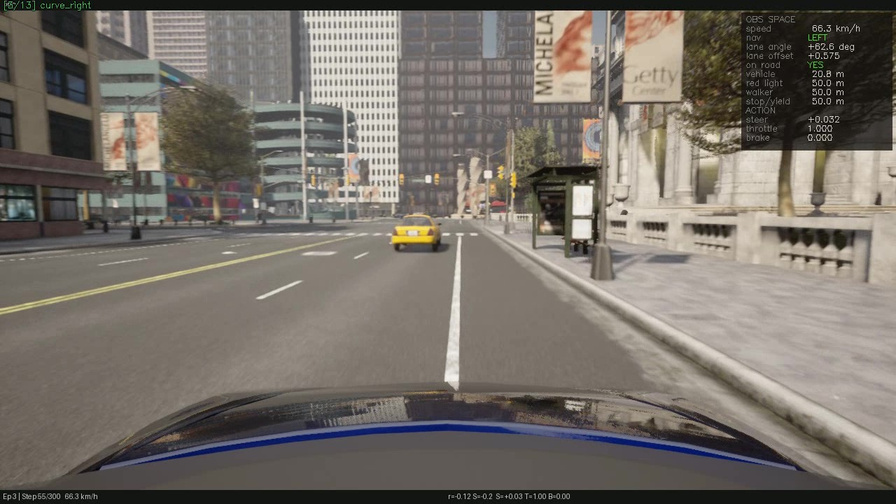</td>
  </tr>
  <tr>
    <td align="center"><sub><em>A CARLA city</em></sub></td>
    <td align="center"><sub><em>What the car sees: the single front camera</em></sub></td>
  </tr>
</table>

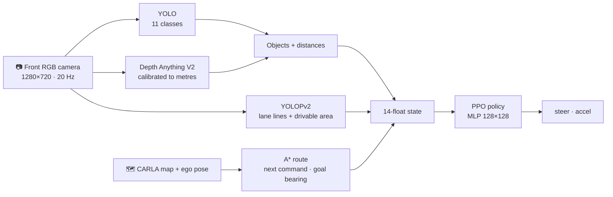

> **What "no ground truth" means here:** lanes, vehicles, pedestrians, traffic lights and signs all come from the camera. The ego position and speed still come from the simulator, the way a real car gets them from GPS and odometry: *the map is the GPS*.

---

## 👁 Seeing the road

**Objects.** A YOLO detector trained on our own CARLA dataset recognizes **11 classes**: vehicle, walker, red, yellow and green lights, speed limits 30, 40, 60 and 90, stop, and yield. Traffic-light colour is double-checked at runtime by counting HSV pixels inside the box ([`src/perception/yolo/`](src/perception/yolo/)).

**Distances.** **Depth Anything V2 (Small)** produces *relative* depth, but the policy needs *metres*. We fit an inverse-disparity model against CARLA's depth camera with least squares:

```
depth_m = 345.64 / (raw + ε) + 0.496          (src/perception/depth/calibration.json)
```

Each object's distance is the **median depth over the central 50 % of its bounding box**, which keeps the background at the box edges out of the estimate ([`src/perception/pipeline.py`](src/perception/pipeline.py)).

<p align="center">
  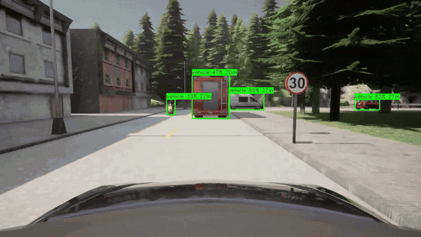
  <br /><sub><em>YOLO + Depth Anything V2 live: every box comes with a class, a confidence and a distance in metres</em></sub>
</p>

<p align="center">
  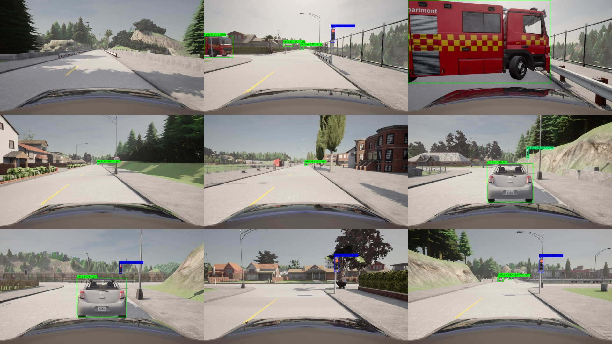
  <br /><sub><em>Vehicles, traffic lights and speed signs, each with its estimated distance</em></sub>
</p>

**Lanes.** **YOLOPv2** outputs two masks: lane lines and drivable area. A geometric post-processing step finds the lane: it closes dashed lines, clusters line pixels near the bottom of the image, tracks each line upward with a sliding window, and fits it. That gives a lateral offset and a direction ([`src/lane_detection/`](src/lane_detection/)).

We first tried classic computer vision with OpenCV (Canny edges and Hough lines). It works on clean, well-marked roads but breaks with changing light and busy scenes. YOLOPv2, a deep multi-task network, stays robust. It also outputs the drivable area, which later turned out to be the key to the whole project.

<p align="center">
  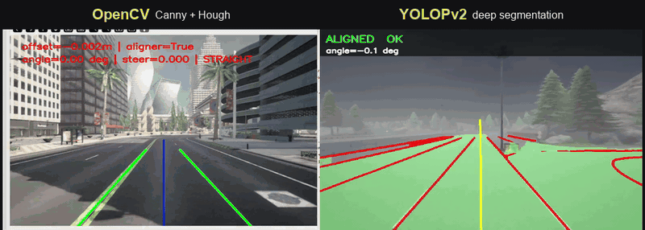
  <br /><sub><em>Left: the OpenCV prototype. Right: YOLOPv2, with the drivable area in green, lane lines in red and the steering hint at the top.</em></sub>
</p>

---

## 🧭 Knowing where to go

The CARLA road network is sampled into a **waypoint graph** with 2 m spacing, and **A\*** plans a route to the destination ([`src/navigation/navigation.py`](src/navigation/navigation.py)). Two signals come out of the route:

- **A high-level command** (`LEFT`, `RIGHT` or `STRAIGHT`) from the route's heading change over the next ~16 m (a ±25° threshold), with a look-ahead that grows with speed.
- **A goal bearing**: the signed heading error to a route waypoint ~24 m ahead, which works like a pure-pursuit target.

The policy never sees the map or its own position: only the current intention and a rough heading, like a driver following GPS. The command is encoded as three one-hot floats rather than a single integer, so the network doesn't learn a fake ordering between left, right and straight.

<table width="100%">
  <tr>
    <td width="45%">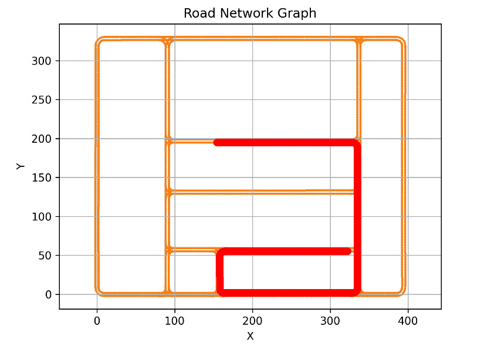</td>
    <td width="55%">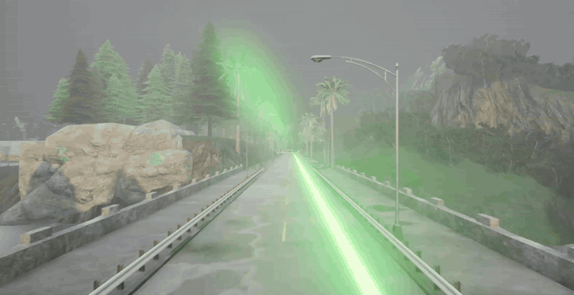</td>
  </tr>
  <tr>
    <td align="center"><sub><em>An A* route (red) on the road network graph</em></sub></td>
    <td align="center"><sub><em>The same kind of route drawn in the simulator as a debug line</em></sub></td>
  </tr>
</table>

---

## 🧠 Deciding what to do

The policy is a **PPO** agent (Stable-Baselines3) with a 128×128 MLP and tanh-squashed outputs. It runs in a custom Gymnasium environment around CARLA in **synchronous mode at 20 Hz** ([`src/ai/training/rl_env.py`](src/ai/training/rl_env.py)).

**It sees 14 numbers:**

| # | Input | Source |
|---|---|---|
| 0 | Speed | Simulator (odometry) |
| 1–3 | Command: left / right / straight | A* route |
| 4 | Lateral offset in the lane | YOLOPv2 (lines, or drivable area as a fallback) |
| 5 | On-road flag | Perception + map at junctions |
| 6 | Nearest vehicle ahead | YOLO + depth |
| 7 | Red light distance | YOLO + depth |
| 8 | Current speed limit | Last speed sign detected |
| 9 | Nearest pedestrian | YOLO + depth |
| 10 | Nearest stop or yield sign | YOLO + depth |
| 11–12 | Previous steer and accel | Policy |
| 13 | Goal bearing | A* route |

**It outputs 2:** `steer` and `accel`. A positive accel is throttle and a negative one is brake.

**It's shaped by a reward with 15 terms** ([`src/ai/rewards/reward_fn.py`](src/ai/rewards/reward_fn.py)). We rewrote it across 23 model versions. The ideas that mattered most:

- **Progress along the route, not as the crow flies.** Potential-based shaping on the remaining *A\* arc length*, so cutting corners doesn't pay.
- **An anti-passivity gate.** The lane-centring bonus only counts while the car moves. Before that, the agent had learned that parking perfectly centred was a safe strategy.
- **A stall penalty that grows** for up to 10 s, waived at red lights, behind a car or near a pedestrian.
- **Collision cost scaled by speed and by how much of the route was left**, so crashing early is the worst outcome.
- Smaller terms penalize speeding, running red lights or stop signs, tailgating (< 2 s headway), getting close to pedestrians, leaving the route and jerky steering.

**It learns with a curriculum.** Destinations start 18–30 m away. Each time the agent succeeds on half of its last 20 episodes, the maximum distance grows by 8 m, up to 70 m. Without the curriculum, versions v9 to v13 reached **zero destinations in ~2,000 episodes**. The first version with it, v14, reached 68.

Training runs with 18 NPC vehicles and 6 pedestrians in traffic, at about 6 environment steps per second. Three GPU networks run on every step, so 110k steps take about 5 hours.

---

## 🧪 From v1 to v23

It took 23 versions to get there. Every training run was recorded, and the clips tell the story better than the reward curves:

<p align="center">
  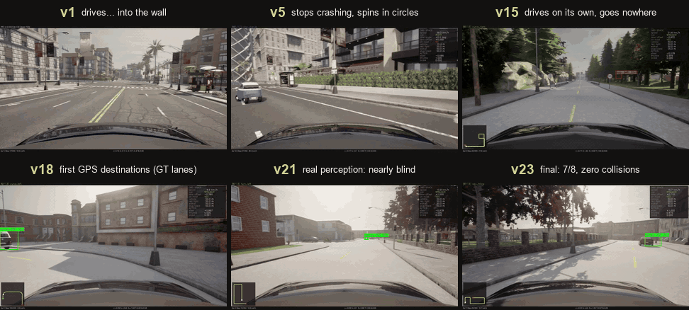
</p>

- **v1–v4:** it drives, accelerates, and crashes. More safety penalties didn't make it brake.
- **v5–v7:** it stops crashing by spinning in circles, then over-fits on the off-road penalty.
- **v15–v18:** with progress measured along the A\* route and the anti-passivity gate, it finally drives on its own and reaches its first GPS destinations, but still on ground-truth lanes.
- **v21–v22:** real perception is plugged in. The car is almost blind, then drives and turns but hugs the edge of the road.
- **v23:** the drivable-area fallback (below) wins 7/8 with zero collisions.

---

## 🔍 The 93.8 % problem

The breakthrough of the project came from measuring things.

**Step 1: find the bottleneck.** We added a diagnostic flag, `--ground-truth-lane`, that replaces the perceived lane offset with CARLA's exact value. Time spent off-road dropped from **~70 % to 1.7 %**. The policy could drive; it just couldn't see the lane. (Ground-truth models were tested this way but don't count toward the final result.)

**Step 2: measure the perception.** Back on real perception, v22 only reached 2/8. We ran a 400-frame probe on Town02 and found that the lane-line detector returned **nothing on 93.8 % of frames**. For most of every episode, the policy was steering on an old lane offset.

**Step 3: use what was already there.** YOLOPv2 already outputs a **drivable-area mask** alongside the lines. Its centroid in the bottom band of the image gives a lateral offset that is:

| Signal | Available on | Correlation with the true offset |
|---|---|---|
| Lane lines | 6.2 % of frames | 0.18 |
| **Drivable-area centroid** | **98.2 % of frames** | **0.57** |

The new rule is: use the lines when they exist, fall back to the drivable area otherwise, and hold the last value as a last resort. The fallback is about 50 lines in [`src/ai/inference/lane_fusion.py`](src/ai/inference/lane_fusion.py), and the lane-detection module itself wasn't touched.

**Step 4: retrain.** **v23 went from 2/8 to 7/8 with zero crashes.** That beat every model trained *with* ground-truth lanes, whose best score was 3/8.

---

## 🏁 The scoreboard

Every checkpoint goes through a **deterministic 13-scenario benchmark** on Town02 ([`src/ai/inference/benchmark.py`](src/ai/inference/benchmark.py)). Eight scenarios are graded:

| Scenario | Success = |
|---|---|
| `straight`, `curve_left`, `curve_right` | ≥ 25 m without a crash (plus staying centred for `straight`) |
| `turn_left`, `turn_right`, `junction_straight` | Reach a GPS destination through a junction |
| `npc_follow` | Follow a slow car without hitting it |
| `npc_crossing` | Handle a car crossing from the right |

Five more scenarios are recorded but not graded: red light, speed zone, pedestrian, emergency stop and lane change.

For every run, the pipeline evaluates 10 evenly spaced checkpoints and records an **annotated video** (HUD with the 14 inputs and 2 outputs, GPS minimap, detection boxes) and a **per-step JSON telemetry** file. It then picks `best_model.zip` automatically, ranking by successes, then distance, then time off-route.

| Model | Lane signal | Graded scenarios | Collisions (13 scenarios) |
|---|---|---|---|
| v18 *(ground-truth lanes, not counted)* | CARLA map | 3/8 | 0 |
| v21 | Lines, discrete command, no bearing | 1/8 | — |
| v22 (88k) | Lines only | 2/8 | most |
| **v23 (88k)** 🏆 | **Lines + drivable-area fallback** | **7/8** | **0** |

v23 won `straight`, both curves, `npc_follow`, `npc_crossing`, and the `turn_right` and `junction_straight` GPS destinations. It only missed `turn_left`, where it drove 66 m without crashing but didn't reach the target.

**Results vary a lot between checkpoints of the same run.** This is the full v23 checkpoint sweep:

| Checkpoint | 11k | 22k | 33k | 44k | 55k | 66k | 77k | **88k** | 99k | 110k |
|---|---|---|---|---|---|---|---|---|---|---|
| Graded | 1/8 | 0/8 | 2/8 | 4/8 | 3/8 | 4/8 | 3/8 | **7/8** | 0/8 | 1/8 |

The 7/8 is the best checkpoint of ten, selected on this same benchmark, and the final 110k model scored only 1/8. We saw overtraining after ~90k steps in four separate runs, which is why the pipeline always evaluates every checkpoint instead of trusting the final one.

---

## 🏭 A dataset that labels itself

To train the detector, we built a collection pipeline that **generates its own labels** ([`src/dataset/`](src/dataset/)):

- **Collection.** CARLA's autopilot drives the car in synchronous mode at 20 FPS, while four cameras record together: **RGB, depth, semantic segmentation and instance segmentation**. A frame is kept only if every sensor delivered that exact simulator frame. Runs loop over towns × weathers, and each run writes a `manifest.csv` (command, speed, controls, collisions, town, weather) and a `metadata.json`.
- **Vehicles and pedestrians.** YOLO boxes are cut from the instance mask, then filtered on size, fill ratio and distance. The ego car's hood is excluded.
- **Traffic lights.** Connected components of the semantic class, re-coloured red, yellow or green by HSV analysis.
- **Signs.** Sign actors are **projected from 3D into the image** with the camera intrinsics and matched to semantic blobs, which assigns `speed_30/40/60/90`, `stop` and `yield`.

<p align="center">
  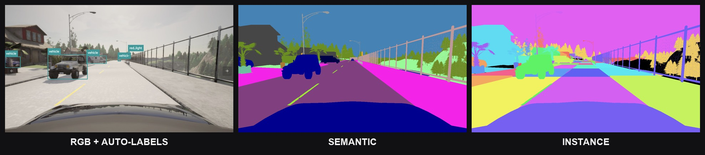
  <br /><sub><em>One frame, three views: RGB with the generated labels (in FiftyOne), semantic segmentation, instance segmentation</em></sub>
</p>

```bash
uv run -m src.dataset collect-multi --enrich     # collect + label over several towns and weathers
```

[FiftyOne](https://docs.voxel51.com) and matplotlib viewers in [`src/tools/`](src/tools/) let us inspect labels and routes.

<p align="center">
  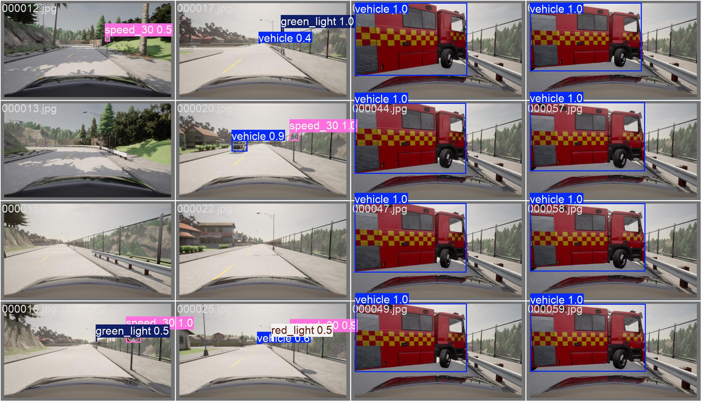
  <br /><sub><em>The trained detector on a validation batch: speed signs, traffic lights and vehicles with their confidence</em></sub>
</p>

---

## 🛰 Serving the policy

A trained policy can be served outside Python:

1. **Export.** [`scripts/export_model_to_onnx.py`](scripts/export_model_to_onnx.py) wraps the SB3 policy (features → MLP → action head → tanh) into an ONNX graph (opset 17, dynamic batch size).
2. **Serve.** [`web/servor/main.cpp`](web/servor/main.cpp) is a **C++ ONNX Runtime** inference server. It listens on TCP port 8080 for an observation as `;`-separated floats and returns the action in the same format. We deployed it on AWS.
3. **Call.** [`web/client/`](web/client/) is a C++ client exposed to Python with **pybind11**. [`main.py`](main.py) runs the car in CARLA and gets each action from the remote server.

This gives the deployment split below. CARLA, navigation and the three perception models run locally, the decision AI runs in the cloud on Amazon EC2, and the two sides talk over sockets:

<p align="center">
  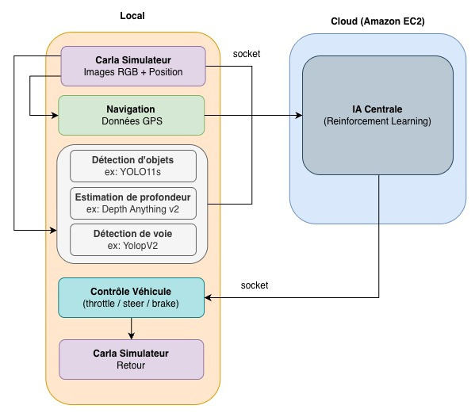
  <br /><sub><em>Architecture diagram from our final presentation (in French)</em></sub>
</p>

---

## 🛠 Under the hood

| Layer | Choice | Why |
|---|---|---|
| **Simulator** | CARLA 0.9.16, synchronous mode at 20 Hz | Deterministic ticks, so training and evaluation can be reproduced. |
| **RL** | Stable-Baselines3 2.9 PPO, gSDE, Gymnasium 1.3 | Stable on-policy learning for continuous control. gSDE gives smoother exploration. |
| **Detection** | Ultralytics YOLO, 11 classes | Fast enough to run on every simulation step. |
| **Depth** | Depth Anything V2 Small (🤗 transformers) + our own metric calibration | Monocular depth, converted to metres. |
| **Lanes** | YOLOPv2 (TorchScript) + geometric post-processing | One network gives both lane lines and drivable area. |
| **Navigation** | A* on CARLA's waypoint graph | Routes, turn commands and the goal bearing. |
| **Serving** | ONNX Runtime C++ server + pybind11 client | Inference without Python, deployable anywhere. |
| **Tooling** | uv (lockfile, CUDA 12.8 wheels for RTX 50xx), black, GitHub Actions | One command sets up the whole environment. |

```
src/ai/             decision AI: Gymnasium env, reward, PPO training, benchmark, demo recorder
src/perception/     object detection (YOLO) + metric depth (Depth Anything V2)
src/lane_detection/ lane lines + drivable area (YOLOPv2)
src/navigation/     A* route planning and high-level commands
src/interfaces/     typed contracts (dataclasses + Protocols) shared by all modules
src/dataset/        data collection, automatic labelling, diagnostics
scripts/            training pipeline, CARLA helpers, ONNX export
web/                C++ ONNX inference server + pybind11 client
main.py             integrated demo (remote inference)
runs/               training artifacts (gitignored)
```

---

## 🚀 Try it yourself

**Requirements:** Python 3.10–3.12, [uv](https://docs.astral.sh/uv/), a reachable **CARLA 0.9.16** server, and an NVIDIA GPU (the perception models run on every step, and CPU is 10–50× slower).

```bash
uv sync
```

This creates the virtual environment and installs everything. uv downloads Python 3.10 automatically if your system doesn't have it.

**Start CARLA** on any machine (Docker or native). The scripts default to `localhost:2000`; use `--host` for a remote server.

```bash
docker run -d --gpus all -p 2000-2002:2000-2002 carlasim/carla:0.9.16 ./CarlaUE4.sh -RenderOffScreen -world-port=2000
```

**Train the policy.** The v23 configuration is:

```bash
uv run python scripts/run_rl_training.py --host <CARLA_IP> --timesteps 110000 --goal-bearing --goal-bearing-lookahead 12 --tag v23
```

Each run writes `runs/<date>_<tag>_<N>k/`, containing `params.json`, `run.log`, the reward curve, checkpoints, `model_final.zip`, the benchmark of 10 checkpoints (videos + `results.json`), the auto-selected `best_model.zip` and a demo video.

| Option | Default | Description |
|---|---|---|
| `--timesteps N` | 500000 | Training length. Our best results came at ~88–110k |
| `--host IP` | localhost | CARLA server address |
| `--npcs N` | 18 | NPC vehicles |
| `--pedestrians N` | 6 | NPC pedestrians |
| `--goal-bearing` | off | Adds the goal-bearing input (used by the final model) |
| `--ground-truth-lane` | off | Diagnostic only: uses CARLA's exact lane offset |

For a quick smoke test, use `--timesteps 1000 --tag smoke`.

**Other entry points:**

```bash
uv run python launch_training.py --host <CARLA_IP>                          # guided first run: checks CARLA, map, CUDA, YOLO weights
```

```bash
uv run python scripts/export_model_to_onnx.py runs/<run>/best_model.zip     # export to ONNX
```

```bash
uv run python main.py --host <CARLA_IP>                                     # integrated demo with remote inference (start web/servor first)
```

```bash
uv run black .                                                              # format
```

---

## 🧾 Honest limits and tech debt

**Known limits of the model**

- **Distance.** It is reliable up to ~150 m per trip, because the curriculum stops at 70 m. Routes of 490–673 m all failed. The next step would be a curriculum up to ~200 m, which means 6–8 hours of training.
- **One town.** It was trained on Town02 only. It still drove ~200 m without collision on Town01, Town03 and Town05, which it had never seen, but it fails quickly on Town04's highways.
- **Braking is the only avoidance move.** The car never changes lanes.
- **Variance.** GPU perception isn't bit-exact, so results vary between runs, and a lot between checkpoints (see the sweep above).

**What's left in the code**

- **Regression on `main`.** A late refactor (`0605d51`) disconnected the drivable-area fallback from the environment. The training scripts still pass the 4-value estimator, so training fails at the first observation. The working v23 code is at commit `415e9e6`.
- **YOLO weights.** The committed `best.pt` is a YOLOv8n checkpoint. The YOLO11s training run (mAP50 0.67 vs 0.58) is in the history at `7c79a8f`.
- **Serving is out of date.** The ONNX model in `web/servor/` comes from an earlier 12-input, 3-output policy, the server address is hard-coded, and the TCP protocol has no message framing. It is also Linux-only.
- **Dead input.** With real perception, the on-road flag (input 5) is effectively constant. The car only notices it has left the road through the off-route penalty and collisions.
- **No tests in the final tree.** Our ~300 unit tests were removed in the pre-submission cleanup, and the CI only runs black.
- **Navigation performance.** A* runs in pure Python and can take several seconds per plan, and it saves a 300-dpi route plot each time it plans.
- **Unused dependencies:** TensorFlow (left over from an early behaviour-cloning attempt), EasyOCR and pygame.

---

## 👥 Team

| | Contributor | Module |
|---|---|---|
|  | **Frédéric Huang** · [@Huang-Frederic](https://github.com/Huang-Frederic) | **Decision AI and integration.** Project setup and typed interfaces, CARLA infrastructure, the dataset collector MVP, the whole RL stack (Gymnasium env, 15-term reward, PPO, curriculum, 13-scenario benchmark, demo recorder with HUD and minimap), the `next_command` rewrite, the v23 drivable-area fallback, 23 model versions, and integration of the four modules |
|  | **Franck Zhuang** · [@franckzhuang](https://github.com/franckzhuang) | **Perception.** YOLO training, Depth Anything V2 calibration and object-distance fusion, the auto-labelling pipeline (instance masks, 3D→2D sign projection, HSV traffic lights), multi-town collection, FiftyOne tooling |
|  | **Karim Arfaoui** · [@Karimarf](https://github.com/Karimarf) | **Lane detection.** YOLOPv2 integration, geometric lane post-processing, live overlay viewer |
|  | **Victor Dalet** · [@victordalet](https://github.com/victordalet) | **Navigation and deployment.** A* route planning, ONNX export, the C++ ONNX Runtime server and pybind11 client, AWS deployment, CI |

---

## 📄 License

This is an academic project. The source code is shared for portfolio and learning purposes only, and no license is granted for commercial use or redistribution. CARLA, YOLOPv2, Depth Anything V2 and Ultralytics YOLO are subject to their own licenses.

---

<div align="center">

Built over five months and 23 model versions. One measurement, 93.8 %, changed everything.

</div>
